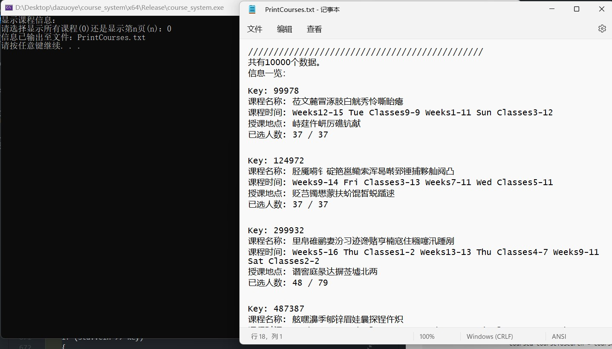
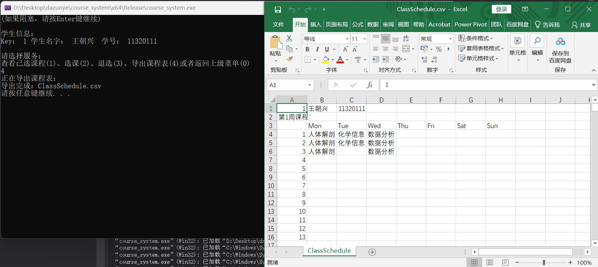
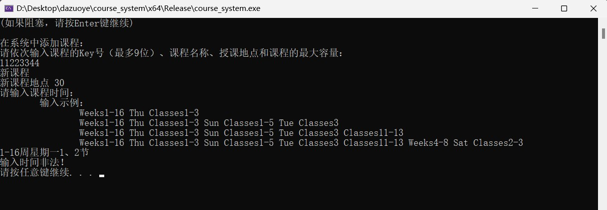
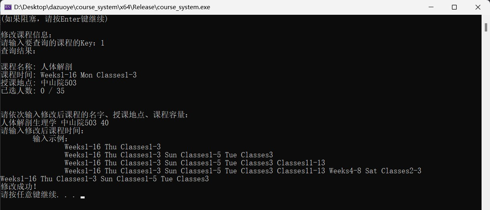

# 选课系统设计
#### 《数据结构与算法》大作业实验报告
#### 生物信息学专业 生物科学与医学工程学院 东南大学
#### 2022/10/29
[TOC]
## 关于实验报告
本次实验报告包含两种格式，分别为用LaTeX生成的pdf文档和用Markdown编写的文档。pdf文档方便打印成纸质报告后阅读，但是因为分页的原因不适合阅读代码片段；Markdown文档虽然不能打印，但是非常适合在电脑上阅读。
## 一、实验内容
设计一个学生选课系统，要求能够查看每个学生所选课程和每个课程选课学生。
## 二、设计思路
对于选课系统来说，最为重要的是学生选课的体验，因此首要目标是**将每次选课、查课等操作的用户等待时间降到最低**。很自然就想到了**查找的时间复杂度为O(1)的哈希表（散列表）**。
因为要能够分别快速查找课程以及学生的信息，所以选择**建立两个哈希表**。分别用于存放课程和学生之间的信息。
考虑实际情况，经常有不同老师授课的同名课程，学生之间重名现象时有发生，所以选择学生和课程的唯一标号作为哈希表的key。**学生哈希表的key是学生的一卡通号，课程哈希表的key是课程号**（虽然课程号可以非数字，但是为了偷懒设定课程号必须为纯数字）。
哈希表的**映射函数选择除数取余法**，采用**拉链法解决地址冲突**。
考虑到一卡通号和课程号没有符号信息，且二者所需的位数不超过9位，unsigned的存储范围已经包括九位十进制数，所以**key选择unsigned型**。
对于学生信息的哈希表结点，除了保存key外还要保存**学生姓名和学号**，二者均以字符串保存，因为不太了解字符串存储的优化的方法，所以直接以**std::string类**存储字符串。
对于课程信息的哈希表结点，除了保存key外还要保存课程名称、地点、时间、课容量。**名称、地点**也采用**std::string类**，**课容量**为**int型**。至于**时间的变量类型**，考虑以一节课为原子时间，一学期有13(节课每天) \* 7(天每周) \* 16 周，即使每节课是否占用的信息以1bit存储，存储一门课程的时间信息也需要占用182bytes，内存占用非常大。所以考虑**使用直接以字符串的形式保存时间数据**，std::string的占用内存于X64 Windows平台为40bytes，**需要使用时间数据时再解析为上述 13\*7\*16bits的形式**，大大减少了内存占用。
除去学生和课程各自的信息，还需要保存学生们选课的信息。一般来说很容易想到使用指针将课程结点和结生节点连接起来，但是因为该选课系统要求既能查看某个学生的选课，又能查看某个课程选课的所有学生，所以需要在课程和学生结点之间需要连接双向的指针，在x64程序内指针的占用为8bytes，而且每位学生可以选很多课，而门课程也能容纳很多学生，这无疑是一笔很大的开销。因此选择**使用unsigned型的key充当课程结点指向学生结点的指针**。因为通过课程结点已经能确定和学生结点的对应关系，**学生结点**想要快速寻找相关课程结点的地址无需采用4bytes的unsigned型存储课程结点的key，可以**保存课程结点在课程哈希表中的bucket数组的索引**，考虑到**unsigned short**可以存储0到65535的整数，而整个选课系统存储的课程数据往往不会超过这么多。就算课程数据量超过65535，只需要保证课程哈希表的bucket数组的容量不超过65536，unsigned short就可以表示其索引，只不过会因为哈希表装载因子增大而导致哈希冲突加剧，但是这点影响相对于其带来的优点显得非常小。
学生结点和课程结点都**以动态数组的方式存储上述的课程的选课学生的key信息以及学生的所选课程的bucket数组索引信息**。因此需要**额外引入一个int型记录动态数组内有几个元素**。关于数组扩容的问题，**课程结点保存选课学生的信息的动态数组的容量即为课程的容量**；而考虑到不同学生选课的数量差异很大，**学生保存选课信息的动态数组采用随时扩容，随时缩减的方式，缩减或扩容均以4个元素（8bytes）为单位**。
关于用户交互部分，本选课系统程序因为数据都保存在内存中，为了防止数据转移到硬盘前数据丢失，在编写该选课系统的用户交互部分时花了很多功夫增强程序的健壮性。
## 三、具体实现
### 1.关于平台、标准
本次选课系统程序设计为了降低工作量，采用了**console窗口交互**的方式，因此调用了很多Windows平台的cmd命令，仅在**Windows平台**可编译成功。我将所有依赖于平台的操作定义为宏，因此非常容易就可以做到修改该程序以支持其他平台，详见本文档*三、7.b.*的部分。并且由于我不确定是否有用到新标准C++的特性，大家在该项目中编译器的C++应不低于**ISO C++ 14标准**，C应兼容**旧MSVC标准**。
### 2.测试方法：单元测试
本次选课系统程序编写过程中采用**两类测试方法**，第一是**在每次完成一些重要功能模块时进行单元测试**，第二是在**程序中留下一个文件IO的接口，通过生成测试文件进行程序功能的整体测试**。
以下是开展单元测试时用到的方法：
#### a.检测内存是否泄漏
检测内存是否泄漏使用的是重载new的方法，在.cpp文件开头添加如下代码:
```
#ifdef _DEBUG
#define DEBUG_CLIENTBLOCK new( _CLIENT_BLOCK, __FILE__, __LINE__)
#else
#define DEBUG_CLIENTBLOCK
#endif
#define _CRTDBG_MAP_ALLOC
#include <crtdbg.h>
#ifdef _DEBUG
#define new DEBUG_CLIENTBLOCK
#endif
```
在程序最后的出口前添加如下代码：
```
_CrtDumpMemoryLeaks();
```
如果出现内存泄漏就会在编译器输出窗口显示并且定位代码位置。
#### b.单元测试相关的宏定义和变量定义
```
static int main_ret = 0, test_pass = 0, test_count = 0, test_NO = 0;
static clock_t startTime, endTime;
#define TEST(actual, expect)\
	do{\
		auto temp = (actual);\
		test_count++;\
		if((expect) == temp)\
			test_pass++;\
		else{\
			std::cerr << __FILE__ << " Line: " << __LINE__ << ": Expect:" << (expect) << " Actual:" << temp << std::endl;\
			main_ret = 1;\
		}\
	}while(0)
```
以上是定义静态变量记录测试的返回值、通过数、测试次数、编号以及开始和结束测试的时刻。
`TEST(actual, expect)`可以方便我们比较期望结果和实际测试结果，如果二者不相符，还能在屏幕上显示出来相关信息。
```
D:\Desktop\dazuoye\course_system\CourseSystem.cpp Line: 1689: Expect:0 Actual:1
```
```
#define START_TEST()\
	do{\
		test_pass = test_count = 0;\
		test_NO++;\
		std::cout << "#### START_TEST " << test_NO << " ####\n测试名称：" << __FUNCTION__ << "\n\n";\
		startTime = clock();\
	}while(0)

#define END_TEST()\
	do{\
		endTime = clock();\
		std::cout << "\n#### END_TEST " << test_NO << " ####\n测试用时： " <<(float)(endTime - startTime) / CLOCKS_PER_SEC << "s\n";\
		std::cout << test_pass << "/" << test_count << " （" << test_pass * 100.0 / test_count << "%） Pass" << "\n\n";\
	}while(0)
```
上面是开始测试和结束测试时的宏定义，值得一提的是因为记录的变量都是静态变量，所以`START_TEST();`和`END_TEST();`不需要一定在同一域。这两个宏定义会让console窗口显示测试信息。
```
#### START_TEST 2 ####
测试名称：test1

课程名称: 数据结构
课程时间: 1-16周 周一 4-5节
授课地点: 东南院204
已选人数: 80 / 100

#### END_TEST 2 ####
测试用时： 0.003s
81/81 （100%） Pass
```
`81/81 （100%） Pass`代表81次`TEST(actual, expect)`中期望与实际相符。
#### c.整个程序过程中的单元测试
根据测试的对象的不同，我把不同阶段的单元测试放在了六个函数中，函数声明如下：
```
// 和课程哈希表有关的测试
void test1();

// 和学生哈希表有关的测试
void test2();

// 和时间解析相关的测试
void test3();

// 和系统添加删除信息有关的测试
void test4();

// 和学生操作有关的测试
void test5();

// 预设一部分学生和课程信息的测试
void test6();
```
### 3.哈希表和结点模板
哈希表和结点模板的声明如下：
```
template<class T> struct ChainNode {
	// 分别对应课程和学生的id
	unsigned key;
	ChainNode<T>* link;

	// 对应每个课程或者学生的信息
	T data;
	ChainNode<T>() : key(0), link(NULL) {}
};

template<class T> class HashTable {
	friend class CourseSystem;
private:
	// 哈希函数中的余数
	int divisor;
	int currentSize, tableSize;
	ChainNode<T>** bucket;

	// 根据key返回对应的bucket索引号和匹配元素的地址，如果没有找到对应元素p返回空指针
	int Hash(unsigned k, ChainNode<T>*& p);
public:
	HashTable<T>(int divisor, int sz);
	~HashTable<T>();

	// 根据key在表中找到相应的元素，如果找到了返回false，找不到则插入且返回true
	bool Insert(unsigned k, const T& el);

	// 根据key搜索对应元素是否在表中
	bool Search(unsigned k);

	// 根据key在表中找到相应的元素，如果找不到返回false，找到则删除且返回true
	bool Remove(unsigned k);

	// 根据key找到对应节点
	// 调用该函数前须调用Search(k)来保证对应元素存在
	ChainNode<T>& Find(unsigned k);

	// 显示所有表中元素
	// 如果n=0直接显示所有结果；n不为0则以5个元素为一页，显示第n页结果
	void PrintHashTable(int n = 0, std::ostream& out = std::cout);
};
```
哈希表的构造、析构函数、插入、搜索、查找、删除都没有什么特色，和书上差别不大，接下来简要介绍一下哈希表的遍历输出。
```
template<class T> void HashTable<T>::PrintHashTable(int n, std::ostream& out)
{
	int print_count = 0;
	out << "//////////////////////////////////////////////\n共有" << currentSize << "个数据。\n";
	if (n)
		out << "第" << n << "页结果：\n\n";
	else
		out << "信息一览：\n\n";
	for (int i = 0; i < tableSize; i++)
	{
		if (bucket[i])
		{
			for (ChainNode<T>* p = bucket[i]; p; p = p->link)
			{ 
				print_count++;
				if ((!n) || (n && print_count > (n - 1) * 5 && print_count <= n * 5))
					out << "Key:\t" << p->key << '\n' << p->data << "\n\n";
				if (n && print_count > n * 5)
					break;
			}
		}
		if (n && print_count > n * 5)
			break;
	}
	out << "\n//////////////////////////////////////////////" << std::endl;
}
```
和传统的输出函数一样，遍历每一个bucket、结点依次输出。该函数不同的地方在于**根据传参n选择全部输出（n=0时）还是仅仅输出第n页（一页有5个元素）的结果**。作出这样的改变的原因是后期测试时发现在console大量输出信息严重拖累程序性能。
另外，还定义了一个函数，**根据输入的整数求小于它的最大质数**，用于**确定哈希映射的除数**。
```
int Divisor(int bucket)
{
	for (int i = bucket; i >= 2; i--)
	{
		bool isPrime = true;
		for (int j = 2; j <= sqrt(i); j++) 
		{
			if (i % j == 0) 
			{
				isPrime = false;
				break;
			}
		}
		if (isPrime)
			return i;
	}
	return 0;
}
```
### 4.课程类的实现
这里提的**课程类**和之后讲的**学生类都是哈希表结点模板`ChainNode<T>`的数据成员T data的实例化**。课程类声明如下：
```
class Course {
	friend class CourseSystem;
private:
	// 课程中学生的数量
	int num, maxSize;

	// 存储选课学生id动态数组
	unsigned* studentList;
	std::string name, place, time;
public:
	Course() : studentList(NULL), num(0), maxSize(0), name(""), place(""), time("") {}
	Course& operator=(const Course& c);
	Course(std::string name, std::string place, std::string time, int maxSize);
	~Course();

	// 添加学生
	bool AddStudent(unsigned studentId);

	// 移除学生
	bool RemStudent(unsigned studentId);

	// 查找学生，返回bucket的索引，如找不到返回-1
	int Search(unsigned studentId);

	// 更改学生容量，如果之前已经选该课的学生数大于新的课容量，学生容量不会更改并返回false
	bool SetSize(int sz);

	friend std::ostream& operator <<(std::ostream& out, Course &course);
};
```
值得一提的是添加选课学生的key进入动态数组和移除时保持动态数组内的元素为**升序**，方便查找时**使用折半查找**将时间复杂度降为O($log_2(n)$)。并且**更改课容量不会导致学生选课信息丢失**，要求**新的课容量不能小于已选学生数**。
```
bool Course::AddStudent(unsigned studentId)
{
	if (maxSize == num)
		return false;
	int i;
	for (i = 0; i < num; i++) // 升序插入
	{
		if (studentList[i] == studentId)
			return false;
		if (studentList[i] > studentId)
			break;
	}
	for (int j = num; j > i; j--)
		studentList[j] = studentList[j - 1];
	studentList[i] = studentId;
	num++;
	return true;
}

bool Course::RemStudent(unsigned studentId)
{
	int i = Search(studentId);
	if (i < 0)
		return false;
	for (int j = i; j < num - 1; j++)
		studentList[j] = studentList[j + 1];
	num--;
	return true;
}

int Course::Search(unsigned studentId)
{ 
	if (num == 0)
		return -1;
	int low = 0, high = num - 1, mid;
	while (low <= high) {   //折半查找
		mid = (low + high) / 2;
		if (studentId == studentList[mid]) {
			return mid;
		}
		else if (studentId < studentList[mid]) {
			high = mid - 1;
		}
		else {
			low = mid + 1;
		}
	}
	return -1;
}
```
### 5.学生类的实现
学生类声明如下：
```
class Student {
	friend class CourseSystem;
private:
	// 学生中课程的数量
	int num, maxSize;

	// 存储学生所选课程所在bucket的索引的动态数组
	unsigned short* courseList;
	std::string name, NO;
public:
	Student() : courseList(NULL), num(0), maxSize(0), name(""), NO("") {}
	Student& operator=(const Student& s);
	Student(std::string name, std::string NO)
		: name(name), NO(NO), courseList(NULL), num(0), maxSize(0) {}
	~Student();

	// 调整动态数组容量，以8字节为单位，broaden为true代表扩容，反之缩减容量
	bool SetSize(bool broaden = true);

	// 添加课程bucket索引号
	bool AddCourseBucket(unsigned short courseBucketIndex);

	// 移除课程bucket索引号
	bool RemCourseBucket(unsigned short courseBucketIndex);

	// 查找课程存放的位置，返回课程对应bucket的索引，如找不到返回-1
	int Search(unsigned short courseBucketIndex);

	friend std::ostream& operator <<(std::ostream& out, Student& student);
};
```
讲设计思路时提到，**学生结点动态数组保存的是所选课程在哈希表中的bucket数组的索引**，但是**学生类在动态数组中添加、删除和查找数据的方法和课程类是相同的，即保持数组升序排序，查找时用折半查找**。
```
bool Course::AddStudent(unsigned studentId)
{
	if (maxSize == num)
		return false;
	int i;
	for (i = 0; i < num; i++) // 升序插入
	{
		if (studentList[i] == studentId)
			return false;
		if (studentList[i] > studentId)
			break;
	}
	for (int j = num; j > i; j--)
		studentList[j] = studentList[j - 1];
	studentList[i] = studentId;
	num++;
	return true;
}

bool Course::RemStudent(unsigned studentId)
{
	int i = Search(studentId);
	if (i < 0)
		return false;
	for (int j = i; j < num - 1; j++)
		studentList[j] = studentList[j + 1];
	num--;
	return true;
}

int Course::Search(unsigned studentId)
{ 
	if (num == 0)
		return -1;
	int low = 0, high = num - 1, mid;
	while (low <= high) {   //折半查找
		mid = (low + high) / 2;
		if (studentId == studentList[mid]) {
			return mid;
		}
		else if (studentId < studentList[mid]) {
			high = mid - 1;
		}
		else {
			low = mid + 1;
		}
	}
	return -1;
}
```
### 6.（解析）时间类的实现
该时间类`class AnalyzedTime`保存的是一个`bool[16][7][13]`的数组，该**数组的每一个元素分别代表**设计思路里提到的**一个学期中课程安排的原子时间**。
选用bool数组而非位操作的原因是该类仅仅在解析记录时间的std::string临时生成，不会存储，所以不会造成大量堆叠，而bool运算相比位运算要快一些，想**通过牺牲一点点内存占用来追求更高的解析效率**。
类声明如下：
```
class AnalyzedTime {
private:
	// 16周，7天，每位代表1节课，每天最多13节课
	bool time[16][7][13];  
public:
	AnalyzedTime();
	// 如果weeks为0，代表1-16周第days天第classes节课
	AnalyzedTime(int weeks, int days, int classes);
	AnalyzedTime& operator =(const AnalyzedTime& t);
	bool operator ==(const AnalyzedTime& t);
	AnalyzedTime& operator +=(const AnalyzedTime& t);
	AnalyzedTime& operator -=(const AnalyzedTime& t);

	// 判断两个时间是否冲突
	bool IsConflict(const AnalyzedTime& t);

	// 清空时间，bool[][][]置false
	void ClearTime();

	// 添加或者移除时间，解析保存在字符串中的时间信息，也可以判断字符串是否合法
	bool SetTime(const std::string strTime, bool add = true);
};
```
该类中的函数成员能实现解析std::string中的时间信息，这就要求我们在**std::string保存时间要遵从一定的格式**，示例如下：
```
// std::string保存时间的格式示例：
// "Weeks1-16 Thu Classes1-3" 
// "Weeks1-16 Thu Classes1-3 Sun Classes1-5 Tue Classes3"
// "Weeks1-16 Thu Classes1-3 Sun Classes1-5 Tue Classes3 Classes11-13" 
// "Weeks1-16 Thu Classes1-3 Sun Classes1-5 Tue Classes3 Classes11-13 Weeks4-8 Sat Classes2-3"
```
简单来讲就是：**表示第几周要用前缀`Weeks`，表示星期使用3字母缩写，表示第几节课的前缀为`Classes`，表示一段时间时用`<int>-<int>`，说明第几节课前必须先指明第几周和星期几**。
`bool AnalyzedTime::IsConflict(const AnalyzedTime& t)`函数**判断两个时间是否冲突**，通过判断两时间是否存在相同的被占用的原子时间。
```
bool AnalyzedTime::IsConflict(const AnalyzedTime& t)
{
	for (int i = 0; i < 16; i++)
		for (int j = 0; j < 7; j++)
			for (int k = 0; k < 13; k++)
				if (time[i][j][k] && t.time[i][j][k])
					return true;
	return false;
}
```
`bool AnalyzedTime::SetTime(const std::string strTime, bool add)`函数的功能为**解析std::string，并根据解析结果更改时间**，是时间类的核心。
该函数的实现用到了**std::stringstream流**来**把原来以空格为分隔的长串分解成一个个待处理的子串**，并且很容易**把数字变量和非数字部分分别读取**；也用到了**std::string中的字符串切片和字符串长度的功能**。函数中有很多的判断分支语句，设计的原则就是上面讲到的时间字符串遵从的格式，目的是使之能够正确识别、应对所有会遇到的错误，增强代码的健壮性。
```
bool AnalyzedTime::SetTime(const std::string strTime, bool add)
{
	std::string temp;
	std::stringstream strStream(strTime);
	int weekBegin = 0, day = 0, weekEnd, classBegin, classEnd;
	char sep;
	while (strStream >> temp)
	{
		if (temp.size() > 7 && temp.size() <= 12 && temp.substr(0, 7) == "Classes" 
				&& weekBegin > 0 && day > 0) // temp中保存的是第几节课的信息，且之前已经得知了周次和星期几
		{
			temp = temp.substr(7, temp.length());
			std::stringstream subStream(temp);
			if (subStream >> classBegin)
			{
				if (classBegin < 1 || classBegin > 13)
					return false;
				if (subStream >> sep)
				{
					if (sep == '-')
					{
						if (subStream >> classEnd)  //  "Classess<int1>-<int2>"
						{
							if (!(1 <= classBegin && classBegin <= classEnd && classEnd <= 16))
								return false; // <int2> 的合法性检查，条件不为true说明合法
						}
						else  // "Classess<int>-"  合法输入：第<int>到13节课
							classEnd = 13;
					}
					else // "Classess<int>!" 非法输入
						return false;
				}
				else   // "Classess<int>"  合法输入：第<int>节课
					classEnd = classBegin;

				// 在bool[][][]中修改课时
				for (int week = weekBegin; week <= weekEnd; week++)
					for (int clasS = classBegin; clasS <= classEnd; clasS++)
						time[week - 1][day - 1][clasS - 1] = add;
			}
			else
				return false;
		} // ====================================================================
		else if (temp.size() > 5 && temp.size() <= 10 && temp.substr(0, 5) == "Weeks")
			// temp中保存的是第几周的信息
		{
			temp = temp.substr(5, temp.length());
			std::stringstream subStream(temp);
			if (subStream >> weekBegin)
			{
				if (weekBegin < 1 || weekBegin > 16)
					return false;
				if (subStream >> sep)
				{
					if (sep == '-')
					{
						if (subStream >> weekEnd)  //  "Week<int1>-<int2>"
						{
							if (!(1 <= weekBegin && weekBegin <= weekEnd && weekEnd <= 16))
								return false; // <int2> 的合法性检查，条件不为true说明合法
						}
						else  // "Week<int>-"  合法输入：第<int>到16周
							weekEnd = 16;
					}
					else // "Week<int>!" 非法输入
						return false;
				}
				else   // "Weeks<int>"  合法输入：第<int>周
					weekEnd = weekBegin;
			}
			else
				return false;
		} // ====================================================================
		else if (temp.size() == 3) // temp中保存的是星期几的信息
		{
			if (temp == "Mon")
				day = 1;
			else if (temp == "Tue")
				day = 2;
			else if (temp == "Wed")
				day = 3;
			else if (temp == "Thu")
				day = 4;
			else if (temp == "Fri")
				day = 5;
			else if (temp == "Sat")
				day = 6;
			else if (temp == "Sun")
				day = 7;
			else
				return false;
		}
		else
			return false;
	}
	return true;
}
```
### 7.CourseSystem类的实现
CourseSystem类是该选课系统程序的最顶层的类，其数据成员包括设计思路里提到的哈希表模板的两种实例化`HashTable<Course>`和`HashTable<Student>`，是**能够连系两个哈希表**的数据结构，并且其**函数成员也提供了该选课系统用户交互的功能**。因此该类的**成员函数也可以分为实现用户交互的函数和连系两个哈希表功能的函数**。
该类的声明如下，可以看到成员函数声明中有一条注释划分的分界线，两端代表的就是两种函数类型。
```
class CourseSystem {
private:
	HashTable<Course> courseList;
	HashTable<Student> studentList;
public:
	CourseSystem(int courseBucket, int studentBucket)
		: courseList(Divisor(courseBucket), courseBucket), 
		studentList(Divisor(studentBucket), studentBucket) {}

	// 删除课程哈希表中的相应学生的信息，用于删除学生前清除学生选课关系
	void RemStudentFromCourses(unsigned studentKey);
	// 删除学生哈希表中的相应课程的信息，用于删除课程前清除学生选课关系
	void RemCourseFromStudents(unsigned courseKey);

	// 根据学生已选课程，求出课程所占用的时间段
	AnalyzedTime TotalTime(unsigned studentKey);

	// 在两个哈希表中登记学生的选课操作
	bool PickCourseInTable(unsigned studentKey, unsigned courseKey);
	// 在两个哈希表中登记学生的退选操作
	bool ExitCourseInTable(unsigned studentKey, unsigned courseKey);

	// 显示学生所有已选的课程信息
	void PrintPickedCourse(unsigned studentKey);

	// 构建课程表csv文件并且从外部应用打开
	void PrintCourseTable(unsigned studentKey);

	// 从文件中读取信息
	// 读取学生\课程信息时，遇到相同key则不在表中添加该信息；
	void ReadFromFile();
	// 将保存的信息写入文件
	void WriteInFile();

	//================================================================================
	// 以该注释为分界线，该类上述的成员函数与数据结构有关，以下成员函数实现的是ui的功能

	// 显示所有课程/学生信息
	void PrintInfo(bool isCourse = true);

	// 添加课程信息，从选课系统界面输入
	void AddCourse();

	// 添加学生信息，从选课系统界面输入
	void AddStudent();

	// 查询课程信息，会显示所有选课的学生
	void SearchCourse();

	// 删除课程/学生信息
	void RemInfo(bool isCourse = true);

	// 学生选课
	void PickCourse(unsigned studentKey);
	// 学生退选
	void ExitCourse(unsigned studentKey);

	// 修改某个学生的信息
	void ResetStudent();

	// 修改某个课程的信息
	void ResetCourse();

	// 学生的操作的循环
	void StudentLoop();

	// 修改数据操作的循环
	void AdminLoop();

	// 主循环
	void MainLoop();

	friend void test5();
	friend void test6();
};
```
#### a.学生选课系统的功能确定
在开始该类的实现前，首先确定了用户能通过该选课程序完成什么功能，以及一些功能的细节，实现这些功能的函数见下面的代码块，**括号内的数字表示用户输入什么能够使用该功能**（在每次用户输入前也都会有提示）。以下会根据不同功能讲解他们是怎么实现的。
```
// 整个选课系统的ui如下：
// MainLoop ─┬ PrintInfo(学生) (1)
//           ├ PrintInfo(课程) (2)
//           ├ SearchCourse (3)
//           ├ StudentLoop (4) ───┬ PrintPickedCourse (1)
//           │                    ├ PickCourse (2)
//           │                    ├ ExitCourse (3)
//           │                    └ PrintCourseTable (4)
//           └ AdminLoop (5) ────┬ AddCourse (1)
//                               ├ RemInfo(课程) (2)
//                               ├ AddStudent (3)
//                               ├ RemInfo(学生) (4)
//                               ├ ResetCourse (5)
//                               ├ ResetStuednt (6)
//                               ├ ReadFromFile (7)
//                               └ WriteInFile (8)
```
#### b.相关宏定义介绍
在实现用户交互的函数中有会多次用到一些cmd命令和对输入缓冲区的某些操作，为了方便编写代码将这一系列操作定义为宏；**如果想要把该程序修改为Linux和Mac上可用，也只需要修改这些宏定义为各平台的功能相同的命令行命令**。此外还有一些参数也定义为宏，方便修改代码。
```
// 清屏
#define CLS (system("cls"))
// 暂停
#define PAUSE (system("pause"))
// 清除输入缓冲区
#define REM_ENTER (std::cin.ignore(1000, '\n')) 
// 外部程序打开文件
#define START(fileName) (system((std::string("start ") + fileName).c_str()))

// 参数设置
// 课程哈希表的bucket容量，应小于65535(unsigned short的范围)，对实际存储的课程数量没有上限
#define COURSE_BUCKET 12500
// 学生哈希表的bucket容量，容量不限
#define STUDENT_BUCKET 125000
// 保存和读取的文件的名字
#define COURSE_FILE_NAME ("COURSE_DATA.csv")
#define STUDENT_FILE_NAME ("STUDENT_DATA.csv")
#define READ_LOG_NAME ("Log.txt")
#define PRINT_STUDENT_NAME ("PrintStudents.txt")
#define PRINT_COURSE_NAME ("PrintCourses.txt")
#define PRINT_CSV_NAME ("ClassSchedule.csv")
```
#### c.直接输出选课系统中所有的学生或者课程的除去选课信息以外的基本信息
对应函数`void PrintInfo(bool isCourse = true)`如下。值得一提的是**如果需要显示的数据大于20个，该函数就会把显示的信息输出到文件上，然后再通过外部应用程序打开**。这么做是因为如果在console窗口里大量输出内容的话会严重拖累程序性能，因此把显示的工作交给更合适的外部应用程序（如输出txt时自动打开notepad）。
效果如下图：

#### d.根据课程的key搜索课程，如找到则显示课程基本信息和选课学生的基本信息
对应函数`void SearchCourse()`。
该函数寻找选课学生的关键是**每个课程结点会用一个动态数组保存选课学生的key，通过key在学生哈希表中查找的时间复杂度为O(1)**，所以无论该选课系统保存了多少学生和课程信息都不会对查找所用时间有所影响。
```
void CourseSystem::SearchCourse() 
{
	unsigned key;
	CLS;
	ResetIStrm();
	std::cout << "查询课程信息：\n请输入要查询的课程的Key：";
	if (std::cin >> key)
	{
		if (courseList.Search(key))
		{
			Course& courseToSearch = courseList.Find(key).data;
			std::cout << "查询结果：\n\n" << courseToSearch << "\n已选该课程的学生：\n\n";
			for (int i = 0; i < courseToSearch.num; i++)
			{
				std::cout << "Key： " << studentList.Find(courseToSearch.studentList[i]).key << '\n';
				std::cout << studentList.Find(courseToSearch.studentList[i]).data <<'\n';
			}
			PAUSE;
			return;
		}
		else
		{
			std::cout << "课程不存在！" << std::endl;
			PAUSE;
			return;
		}
	}
	std::cout << "输入错误！" << std::endl;
	PAUSE;
	return;
}
```
#### e.根据key搜索学生信息，并且输出选课信息
**该功能包括之后学生选课、退选、输出课程表都是在函数`void StudentLoop()`中调用**。
该功能对应的函数为`void PrintPickedCourse(unsigned studentKey)`。
函数实现的方法简单描述为：**在学生哈希表根据学生的key找到学生结点，学生结点中有一个保存所选课程所在bucket的索引的动态数组，根据该索引找到课程哈希表中存有已选课程结点的链表头结点的位置，对每个链表遍历，输出链表中已选学生包含该学生的课程结点**。因为学生结点保存的是课程结点所在bucket的索引而非课程的key，所以**从学生查找课程结点的速度受限于每个课程哈希表的bucket链表上有多少结点，即与课程哈希表的装载因子有关**。而装载因子是可以通过增加哈希表bucket容量而减小的，换言之可以通过牺牲空间换取时间效率。
```
void CourseSystem::PrintPickedCourse(unsigned studentKey)
{
	Student& student = studentList.Find(studentKey).data;
	unsigned short courseBucketIdx;
	int count = 0;
	for (int i = 0; i < student.num; i++)
	{
		courseBucketIdx = student.courseList[i];
		for (ChainNode<Course>* p = courseList.bucket[courseBucketIdx]; p; p = p->link)
		{
			if (p->data.Search(studentKey) != -1)
			{
				std::cout << "\nKey： " << p->key << '\n';
				std::cout << p->data;
				count++;
			}
		}
	}
	std::cout << "\n一共有" << count << "个课程。" << std::endl;
}
```
#### f.学生选课
学生选课的功能对应`void PickCourse(unsigned studentKey)`这个成员函数。
学生选课实现的过程简单来说是**用户输入课程key**，根据学生的key和课程的key，进行一系列的判断来**确定学生是否符合选课条件**：**对应key的课程是否存在、课程是否已满、学生之前是否已经选过该课程、时间是否冲突**。在确定学生可以选这门课后**再次确认学生是否选择该课程**，如果学生确定选课就**分别对课程哈希表和学生哈希表中的对应结点建立关联关系**。
上述确定时间是否冲突的是以下代码：
```
AnalyzedTime totalTime = TotalTime(studentKey), courseTime;
courseTime.SetTime(CourseToSearch.time);
if (totalTime.IsConflict(courseTime))
{
    std::cout << "时间冲突，无法选课！" << std::endl;
    PAUSE;
    return;
}
```
其中`AnalyzedTime TotalTime(unsigned studentKey)`也是CourseSystem的成员函数，用于**返回某个学生已选课程的总时间**。代码如下，简**单描述就是创建一个全空的总时间，对学生所选课程遍历，解析每个学生所选课程的std::string类时间，根据解析结果累加到总时间上**。
```
AnalyzedTime CourseSystem::TotalTime(unsigned studentKey)
{
	const Student& studentToSearch = studentList.Find(studentKey).data;
	AnalyzedTime totalTime;
	unsigned short courseBucketIdx;
	for (int i = 0; i < studentToSearch.num; i++)
	{
		courseBucketIdx = studentToSearch.courseList[i];
		for (ChainNode<Course>* p = courseList.bucket[courseBucketIdx]; p; p = p->link)
		{
			if (p->data.Search(studentKey) != -1)
				totalTime.SetTime(p->data.time);
		}
	}
	return totalTime;
}
```
上述分别对课程哈希表和学生哈希表中的对应结点建立对应关系的函数是`bool PickCourseInTable(unsigned studentKey, unsigned courseKey)`，**实现方法为在课程结点的动态数组中添加选课学生的key，在学生结点的动态数组中添加所选课程所在课程哈希表的bucket索引**。值得一提的是`Course::AddStudent(studentKey)`和`Student::AddCourseBucket(courseBucketIdx)`这两个函数在添加信息时如果动态数组里已有相同信息就不会再额外添加，因此可以防止因某个学生所选课程正好位于课程哈希表中的同一bucket的链表中而重复存取该索引的错误。
```
bool CourseSystem::PickCourseInTable(unsigned studentKey, unsigned courseKey)
{
	if (!courseList.Find(courseKey).data.AddStudent(studentKey))
		return false;
	ChainNode<Course>* temp;
	unsigned short courseBucketIdx = courseList.Hash(courseKey, temp);
	studentList.Find(studentKey).data.AddCourseBucket(courseBucketIdx);
	return true;
}
```
#### g.学生退选
功能对应`void ExitCourse(unsigned studentKey)`函数。
相比选课，退选不需要判断时间是否冲突、课程是否已满，**只需要满足课程存在且学生选了该课程就符合退课条件**。
确定可以退课后调用的函数是`bool ExitCourseInTable(unsigned studentKey, unsigned courseKey)`，代码如下，简单描述就是**直接在课程结点动态数组中删除对应学生的key**；在**学生结点的动态数组中**不能直接删除课程对应的bucket索引，因为该索引下可能还有其他课程也被该学生选择，因此**只有在判断该bucket索引下除了待退选的课程外没有其他被该学生选课的课程才会删去该索引**。
```
bool CourseSystem::ExitCourseInTable(unsigned studentKey, unsigned courseKey)
{
	if (!courseList.Find(courseKey).data.RemStudent(studentKey))
		return false;
	ChainNode<Course>* courseNode;
	unsigned short courseBucketIdx = courseList.Hash(courseKey, courseNode);
	// 先找在课程哈希表中的相同bucket是否有待处理的学生选的课
	bool otherCourseInSameBucket = false;
	for (ChainNode<Course>* p = courseList.bucket[courseBucketIdx]; p; p = p->link)
	{
		if (courseNode == p)
			continue;
		if (p->data.Search(studentKey) != -1)
		{
			otherCourseInSameBucket = true;
			break;
		}
	}
	// 如果没有的话就删除该bucket的索引
	if (otherCourseInSameBucket == false)
		studentList.Find(studentKey).data.RemCourseBucket(courseBucketIdx);
	return true;
}
```
#### h.输出学生的课程表
对应函数`void PrintCourseTable(unsigned studentKey)`。
简单描述该函数就是**对于每一个原子时间（某周某天的某节课），查找学生的所有选课中是否包含该原子时间的课程，如果有就在对应位置输出到csv文件，等csv文件输出完成后就用cmd命令打开系统默认的csv读取程序**（Windows电脑一般是Excel）。
效果如下：

#### i.在选课系统中添加课程信息
对应函数`void AddCourse()`。
添加课程之前会**判断待添加的课程key是否已经被占用、保存时间的字符串是否符合规范**，如果二者都没问题就会**在课程哈希表中添加该课程信息的节点**。
效果如下：

#### j.在选课系统中添加学生信息
对应函数`void AddStudent()`。
相比添加课程信息更加简单，并且仅仅需要判断待添加的学生key是否已经被占用。
#### k.从选课系统中删除课程/学生信息
对应函数`void RemInfo(bool isCourse = true)`。
删除前需要**根据key判断该课程/学生信息是否存在**。
**删除某一课程前，先调用`void RemCourseFromStudents(unsigned courseKey)`让所有选了该课程的学生退选该课程；同理，删除某一学生前，先调用`void RemStudentFromCourses(unsigned studentKey)`退选该学生的所有课程**。
```
void CourseSystem::RemStudentFromCourses(unsigned studentKey)
{
	const Student& studentToDel = studentList.Find(studentKey).data;
	unsigned short courseBucketIdx;
	for (int i = 0; i < studentToDel.num; i++)
	{
		courseBucketIdx = studentToDel.courseList[i]; //学生存储的选课信息不是课程的Key，而是课程的Bucket索引
		for (ChainNode<Course>* p = courseList.bucket[courseBucketIdx]; p; p = p->link)
		{
			p->data.RemStudent(studentKey);
		}
	}
}

void CourseSystem::RemCourseFromStudents(unsigned courseKey)
{
	ChainNode<Course>* pCourseToDel;
	unsigned short courseBucketIdx = courseList.Hash(courseKey, pCourseToDel);
	for (int i = 0; i < pCourseToDel->data.num; i++)
	{
		// 先找在课程哈希表中的相同bucket是否有待处理的学生选的课
		bool otherCourseInSameBucket = false;
		for (ChainNode<Course>* p = courseList.bucket[courseBucketIdx]; p; p = p->link)
		{
			if (pCourseToDel == p)
				continue;
			if (p->data.Search(pCourseToDel->data.studentList[i]) != -1)
			{
				otherCourseInSameBucket = true;
				break;
			}
		}
		// 如果没有的话就删除该bucket的索引
		if (otherCourseInSameBucket == false)
			studentList.Find(pCourseToDel->data.studentList[i]).data.RemCourseBucket(courseBucketIdx);
	}
}
```
#### l.修改学生/课程信息
对应函数`void ResetStudent()`和`void ResetCourse()`
唯一需要注意的是**新课程信息中时间信息要符合规范，并且修改后课程容量不能小于已选学生数**。
截图如下：

#### m.将选课系统中的数据保存在文件中
对应函数`void WriteInFile()`。
分别**遍历学生哈希表和课程哈希表，将结点信息保存在两个csv文件中**。存为csv格式的原因是**方便其他程序读取、修改**。注意保存学生的csv只保存学生第基本信息，而保存课程的csv除了保存课程的基本信息，还有保存选课的学生的key。
保存的顺序如下：
```
// .csv文件保存，无列名行
// 课程数据：key, name, place, time, maxSize, studentKey *
// 学生数据：key, name, NO
```
#### n.将文件中的数据读入选课系统
对应函数`void ReadFromFile()`。
因为csv文件是按行保存的文件，**每次读取时一次性读取一行内容，后续的操作将对该行内容建立的std::stringstream流进行**，通过这种方式**保证了不同行之间的错误不会互相干扰**。
因为保存学生数据的文件仅仅存有学生基本信息，所以每次读入一行时**仅需要判断选课系统中是否有相同key的学生**，若没有可以直接将新的学生结点插入学生哈希表。
读取**课程数据时**，除了**判断是否key被占用、课程时间的std::string是否符合规范**，还要**判断每一个选课的学生选了这门课程后是否会发生时间冲突，如果不发生冲突才能办理选课**。
所有的**出错信息会保存在一个txt文件中**，方便后续查看。
## 四、运行结果
### 1.生成测试数据
虽然此前已经在每一个功能模块完成后进行了功能测试，但是最终还是要模拟该选课系统程序在高压状态下的运行状态。
为了生成供程序测试的数据，我还编写了一个用于**生成测试数据的脚本**`GenerateTestData.py`。
该脚本生成的**学生数据量和选课数据量可以在函数`main()`中更改**，生成的**学生名字是随机汉字**、**学号是随机8位或者9位数字**；，时间生成的代码如下**生成的课程名字、地点也是随机汉字**：
```
dayLs = [' Mon', ' Tue', ' Wed', ' Thu', ' Fri', ' Sat', ' Sun']
weekLs = [' Weeks1-16', ' Weeks4-8', ' Weeks1-12', ' Weeks4-16']
n = random.randint(1, 4)
time = ""
for j in range(n):
    time += random.choice(weekLs) + random.choice(dayLs)
    classBegin = random.randint(1, 11)
    time += " Classes{}-{} ".format(classBegin, classBegin + 2)
```
**每个课程的最大容量都是5到`maxSizePerCourse`的随机数，脚本会根据课程容量安排满学生选课**，随机选课关系生成的代码如下：
```
count = 0
maxSize = random.randint(5, maxSizePerCourse)
for j in range(maxSize):
    course.append(count % studentNum)
    count += 1
```
要注意的是：**随机生成的选课关系是没有考虑和学生时间是否有冲突，所以选课系统导入脚本生成的测试文件时会提示很多时间冲突错误**，这是正常现象。
```
CourseKey：457390 StudentKey：54055 学生选课失败，时间冲突！
```
### 2.测试方法
(1)更改`CourseSystem.cpp`开头的参数设置中的宏定义，根据估计的数据规模和理想的装载因子，更改两个哈希表的bucket数组容量`COURSE_BUCKET`和`STUDENT_BUCKET`
(2)通过更改`GenerateTestData.py`中的变量`courseNum`、`studentNum`和`maxSizePerCourse`确定随机生成的测试数据量。
(3)运行`GenerateTestData.py`得到两个随机生成的测试csv文件，将他们移动到学生选课系统程序的相同目录下。
(4)运行学生选课程序，通过*管理员组操作 -> 读取数据*读取测试数据。
通过这种方法，可以快速读取大量包含学生、课程以及选课信息的数据，以便我们开展之后的测试。
### 3.测试结果
以下所有测试设定**最大课容量为150人**，即生成的课程数据的课容量为5到150的随机数。
(1)**课程数一万，学生数十万，**`COURSE_BUCKET 12500`，`STUDENT_BUCKET 125000`：
估计测试文件中的选课数：10000 \* (5+150)/2 = 775000
测试结果如下：
峰值占用内存：24.5MB
读取测试文件时间：11.174s
选课失败数：366322
选课成功数：775000 - 366322 = 408678
保存数据文件时间：0.21s
显示所有学生时间：0.092s
显示所有课程时间：0.025s
分页显示学生/课程信息、显示某个课程的所选学生、显示某个学生所选课程、显示课程表、选课、退选、添加删除修改课程信息、添加删除修改学生信息体感上均感受不到卡顿。
(2)**课程数五万，学生数六十万，**`COURSE_BUCKET 60000`，`STUDENT_BUCKET 800000`：
估计测试文件中的选课数：50000 \* (5+150)/2 = 3875000
测试结果如下：
峰值占用内存：131.5MB
读取测试文件时间：50.515s
选课失败数：1653789
选课成功数：3875000 - 1653789 = 2221211
保存数据文件时间：1.118s
显示所有学生时间：0.548s
显示所有课程时间：0.12s
分页显示学生/课程信息、显示某个课程的所选学生、显示某个学生所选课程、显示课程表、选课、退选、添加删除修改课程信息、添加删除修改学生信息体感上均感受不到卡顿。
(3)**课程数十万，学生数一百八十万，**`COURSE_BUCKET 65000`，`STUDENT_BUCKET 1800000`：
估计测试文件中的选课数：100000 \* (5+150)/2 = 7750000
测试结果如下：
峰值占用内存：340.7MB
读取测试文件时间：80.048s
选课失败数：2577145
选课成功数：7750000 - 2577145 = 5172855
保存数据文件时间：2.912s
显示所有学生时间：1.608s
显示所有课程时间：0.246s
分页显示学生/课程信息、显示某个课程的所选学生、显示某个学生所选课程、显示课程表、选课、退选、添加删除修改课程信息、添加删除修改学生信息体感上均感受不到卡顿。
## 五、实验小结
### 1.性能分析
从测试结果来看，随着该选课系统的数据量的不断增大，**常见用户操作（选课、查课等）的时间基本没有变化**，可以认为**用户的体验是非常好的**，这依赖于哈希表这种经典数据结构在时间性能上的优越性。虽然当数据规模较大时，**从文件中读取数据进入的时间较大**，但是认为对于一个长期运行的程序来说，从文件中读取数据的操作类似于服务器的开机，**对于正常用户的体验是没什么影响的**。**从内存占用方面来看该数据结构带来的负面作用仍在可以接受的范围内**。
### 2.改进方向
(1)完善功能，比如根据课程名字搜索课程的功能。如果使用传统的遍历搜索的话我觉得对于大数据来说耗时过长，对此我有一个设想，能不能通过一个特殊的哈希映射使得两个key可以映射出一个确切的结果，而一个key仅仅映射一个范围，但是能减少查找所需的遍历次数；或者是使用什么特殊的搜索算法或数据结构。
(2)虽然这个程序已经具有一定的健壮性，但是仍然不能排除因为用户误操作导致数据丢失，最保险的方法应该是用户操作端和数据处理端应该分离，让每个程序专职与自己负责的部分，这样也能提高处理的效率。
(3)数据结构上的优化，比如优化字符串的使用，或者用一些别的结构代替动态数组等。